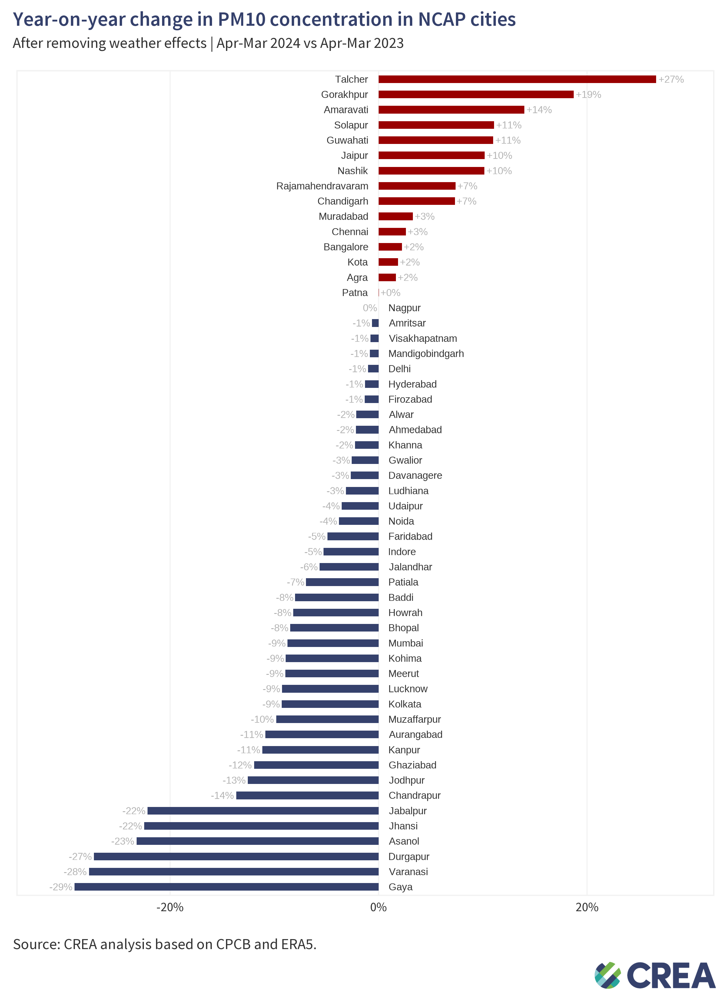
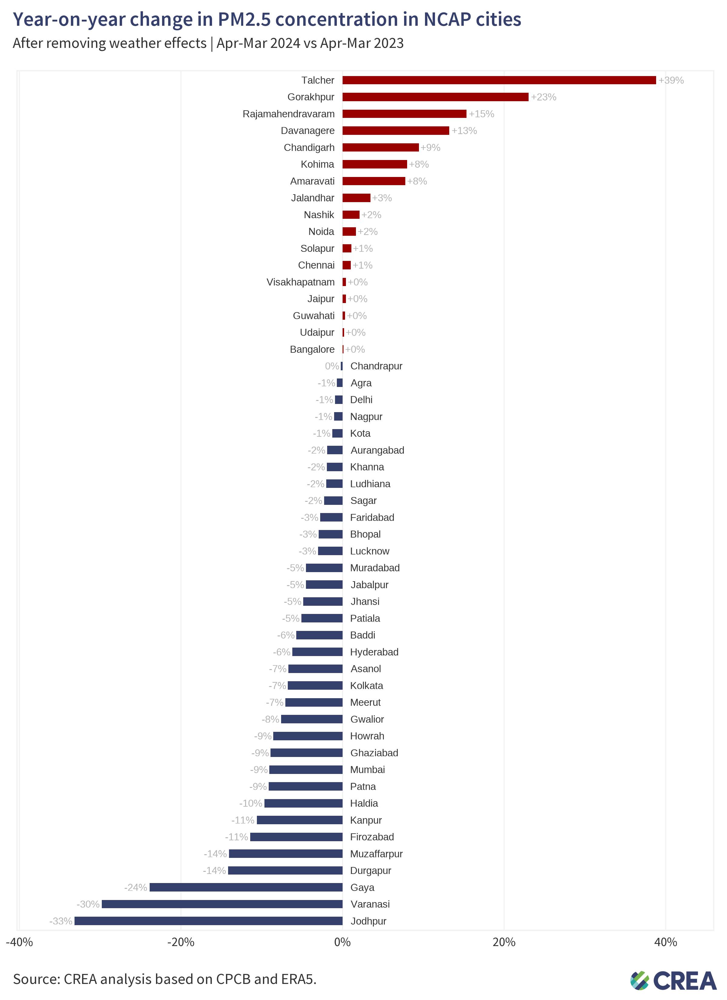
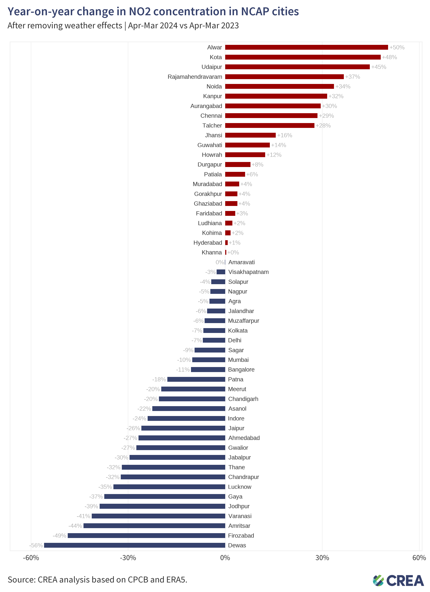
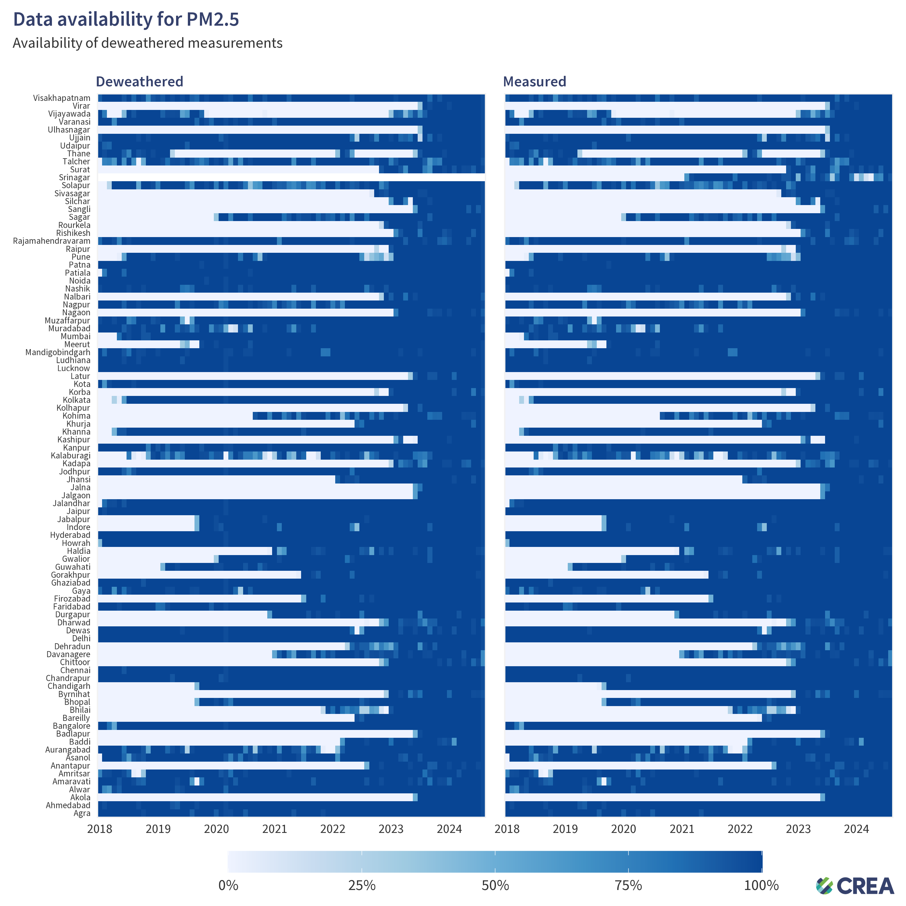
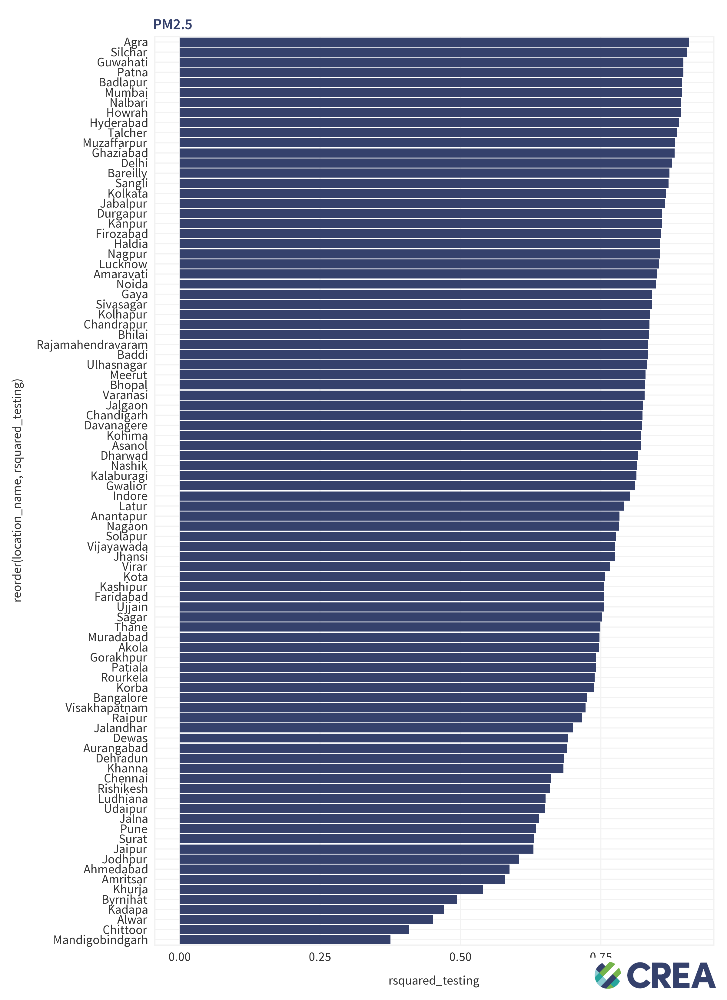
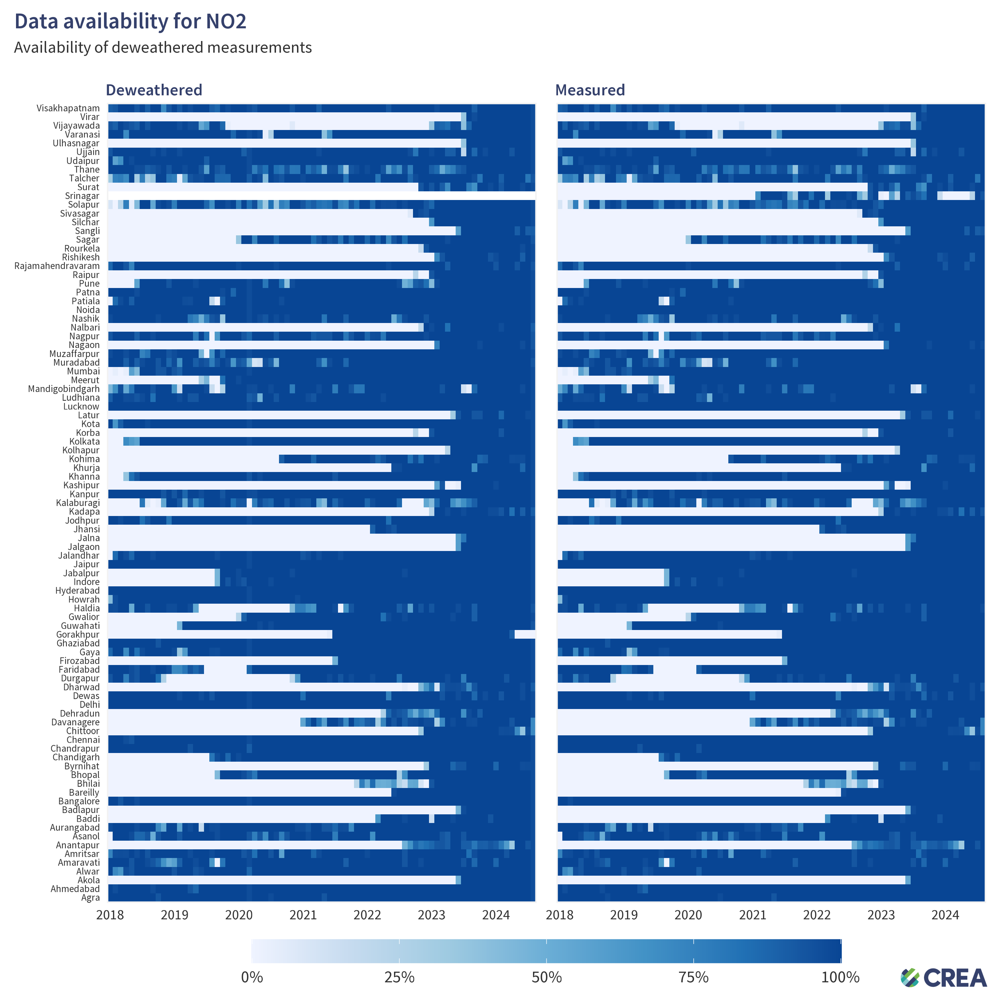
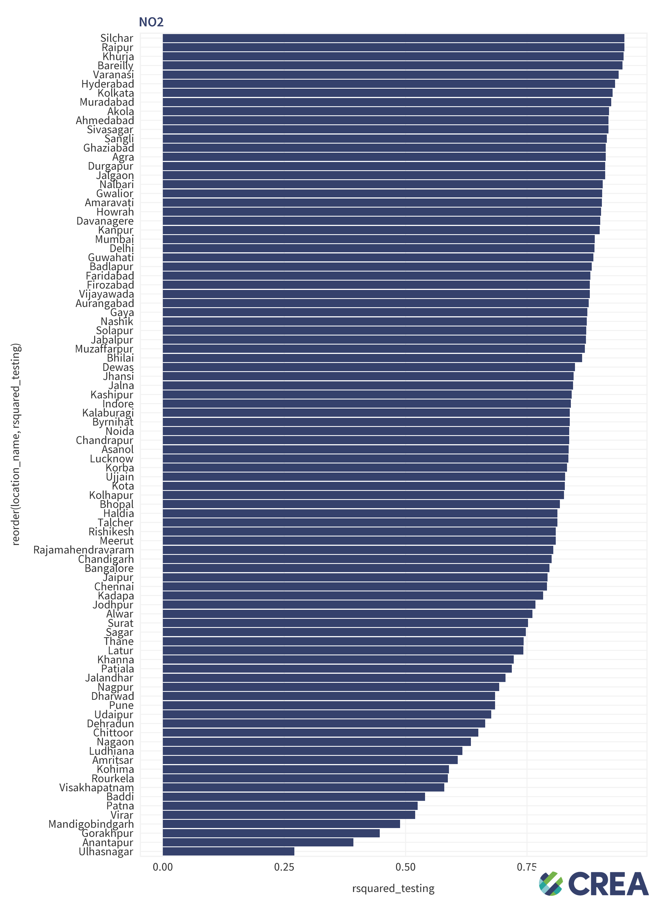

# 202409_india_deweather

Build and analyse deweathered data for NCAP cities.

Author: [Hubert Thieriot](mailto:hubert@energyancleanair.org)

## Table of Contents
- [Results](#results)
- [Diagnostics](#diagnostics)
- [Methodology](#methodology)

## Results

### PM10
Data is available here:
- [narrow csv file](results/yoy_pm10.csv)
- [wide csv file](results/yoy_pm10_wide.csv)

### PM2.5
Data is available here:
- [narrow csv file](results/yoy_pm25.csv)
- [wide csv file](results/yoy_pm25_wide.csv)

### NO2
Data is available here:
- [narrow csv file](results/yoy_no2.csv)
- [wide csv file](results/yoy_no2_wide.csv)

## Diagnostics

### PM10

### PM2.5

### NO2

## Methodology
See [methodology](./methodology.md) for details on how the data was collected and processed.

