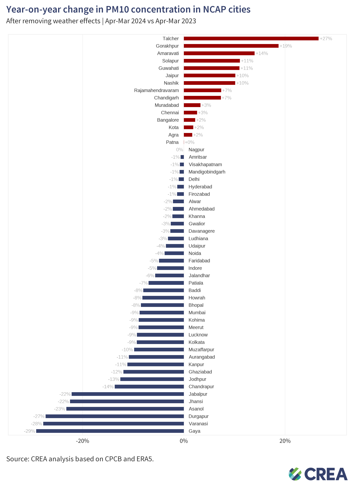
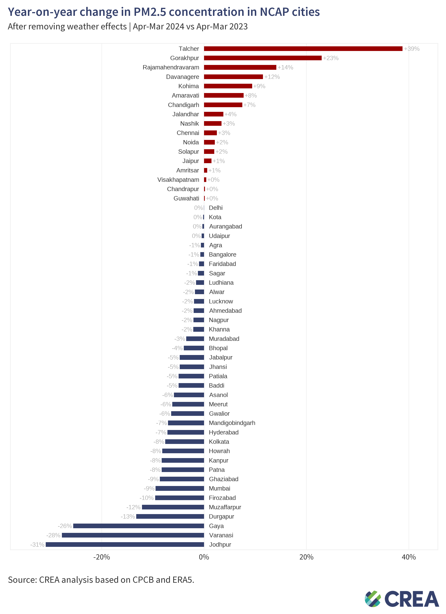
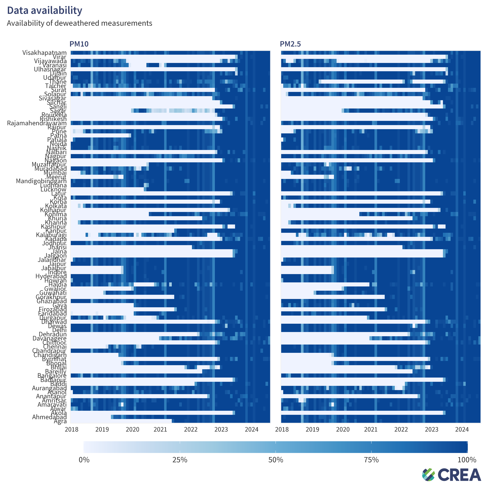
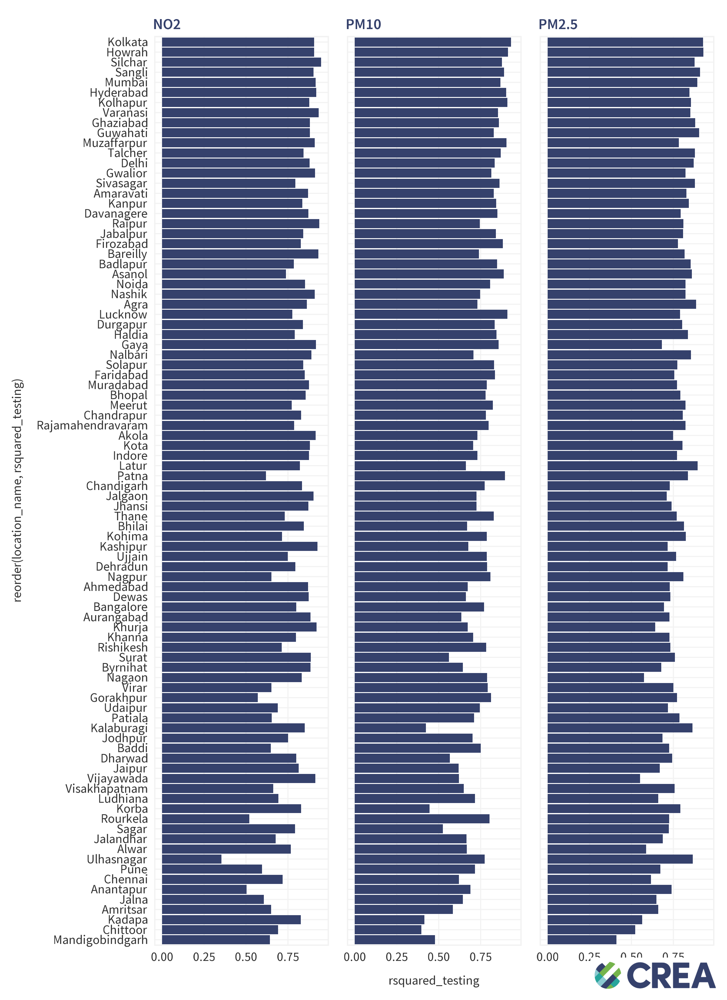

# 202409_india_deweather
Build and analyse deweathered data for NCAP cities

## Table of Contents
- [Results](#results)
- [Diagnostics](#diagnostics)
- [Methodology](#methodology)

## Results

### PM10
Data is available here: [csv file](results/yoy_pm10.csv)

### PM2.5
Data is avialable here: [csv file](results/yoy_pm25.csv)

## Diagnostics

## Methodology
See [methodology](./methodology.md) for details on how the data was collected and processed.

