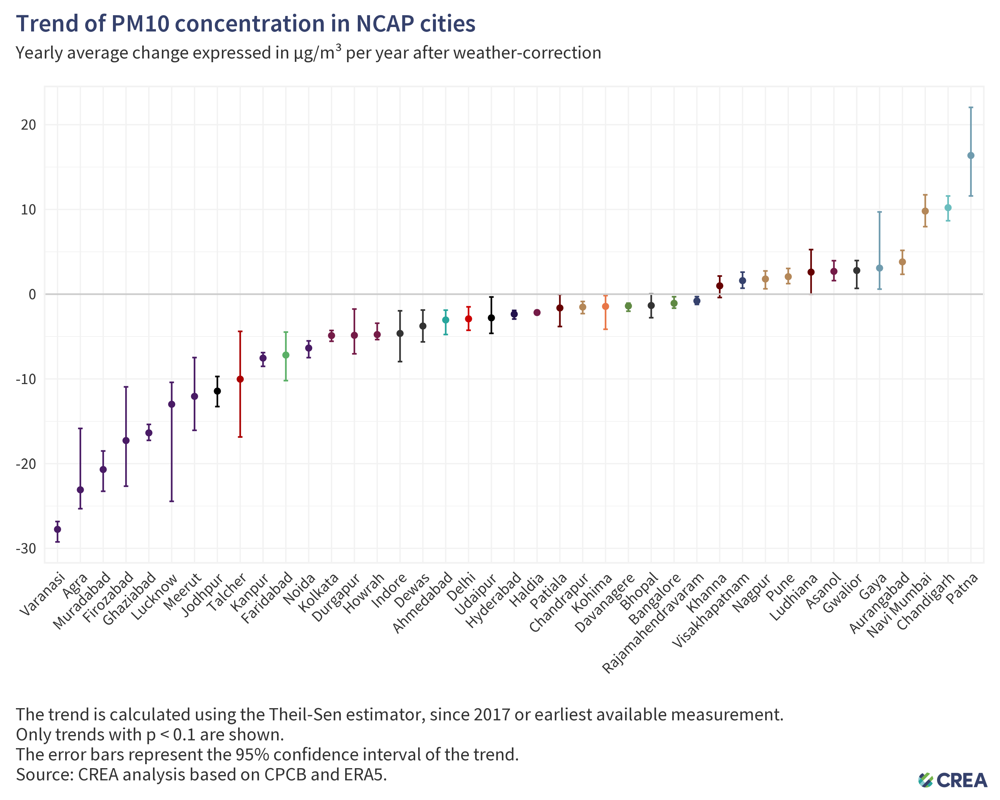
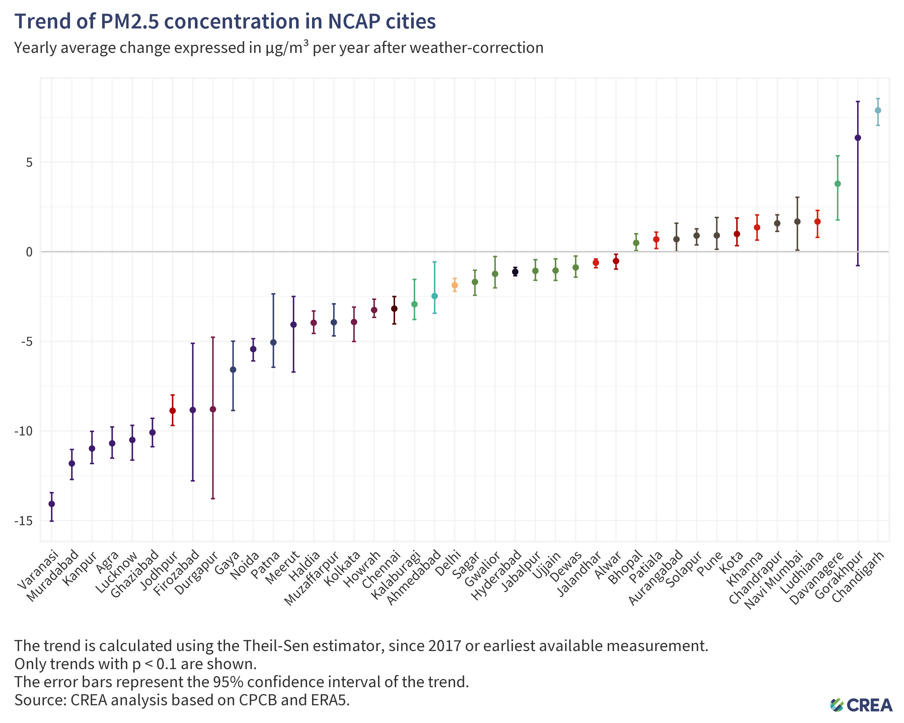
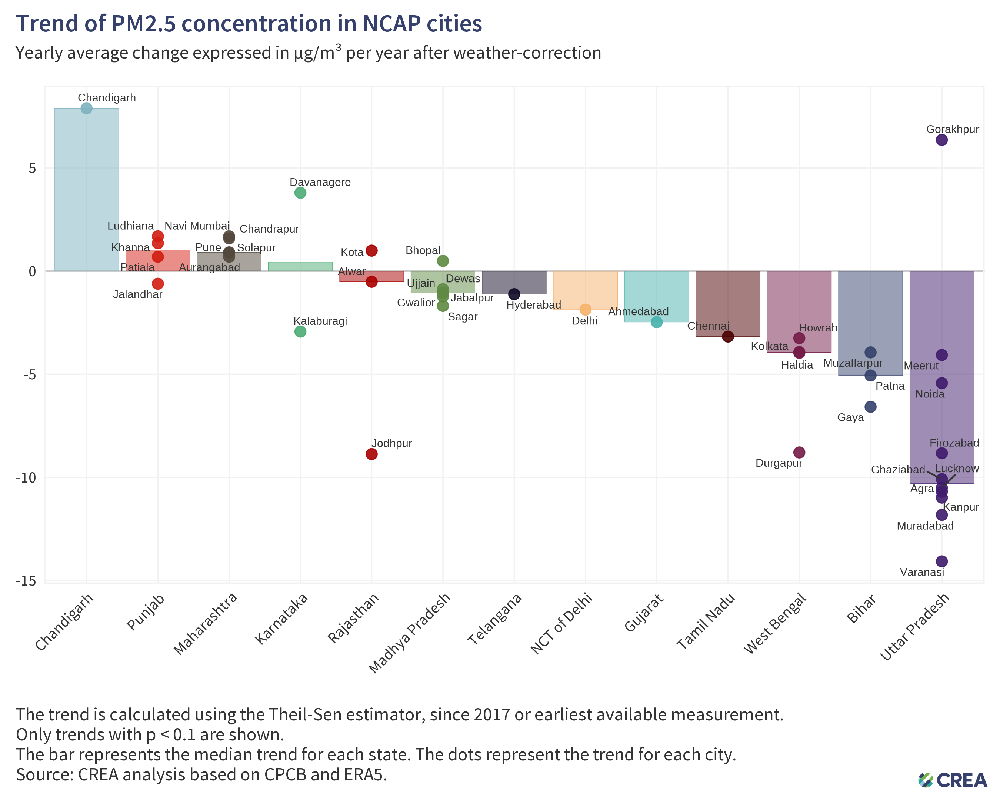
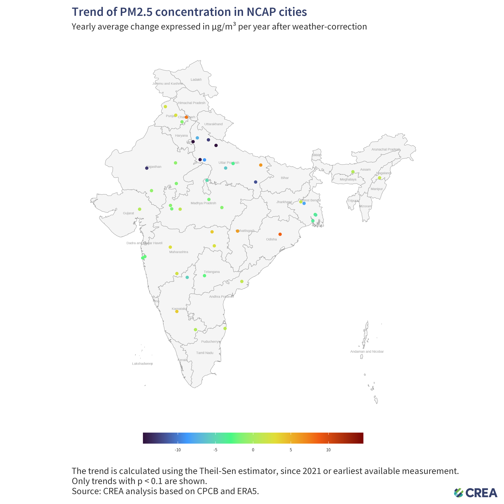
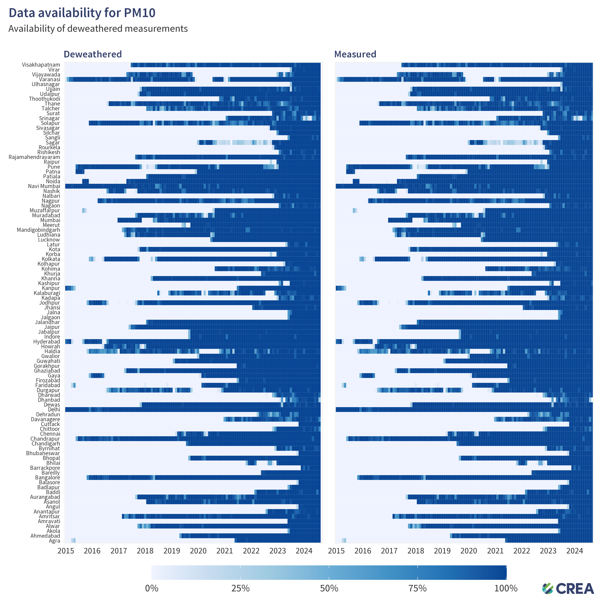

# 202409_india_deweather

Analysing PM10 trends in NCAP cities, with weather-normalisation and comparison with satellite-derived AOD.

Author: [Hubert Thieriot](mailto:hubert@energyancleanair.org)

## Table of Contents
- [Results](#results)
- [Diagnostics](#diagnostics)
- [Methodology](#methodology)

## Results

### Wheather-normalisation
We first normalise for weather conditions (see [methodology](./methodology.md)):

We then extract overall trends for each city, since 2017 or the earliest available data,
using Theil-Sen estimator (data available [here](results/trends.csv)):

Regrouping by state:

If we consider more recent data only, i.e. from 2021 onwards, both to include more cities and to avoid COVID year:

All covered cities in Uttar Pradesh show significant decrease in PM10 levels since 2017.

We do similar analysis for PM2.5, which has slightly better time coverage:

Regrouping by state:

If we consider more recent data only, i.e. from 2021 onwards:

### Comparison with satellite-derived AOD
There has been some suspicion over Uttar Pradesh data. I compare ground-truth measurements of PM10 and PM2.5 with MODIS AOD.

## Diagnostics

### PM10

## Methodology
See [methodology](./methodology.md) for details on how the data was collected and processed.

